# Pi Monorepo -- Architecture Guide

A plain-English walkthrough of everything inside this repo: what each piece does, how they connect, where security lives, and how you can jump in and start building powerful agentic systems.

---

## 1. The 30-Second Elevator Pitch

Pi is a **toolkit for building AI agents**. Think of it as a layered cake:

- **Bottom layer** -- talk to any LLM (OpenAI, Anthropic, Google, Mistral, local models...)
- **Middle layer** -- give an LLM tools (bash, file editing, search) and let it act autonomously
- **Top layer** -- polished apps: a terminal coding assistant, a Slack bot, a web chat UI, a GPU pod manager

Everything is TypeScript, everything is open-source (MIT), and all seven packages live in this single monorepo.

---

## 2. Package Map -- The Big Picture

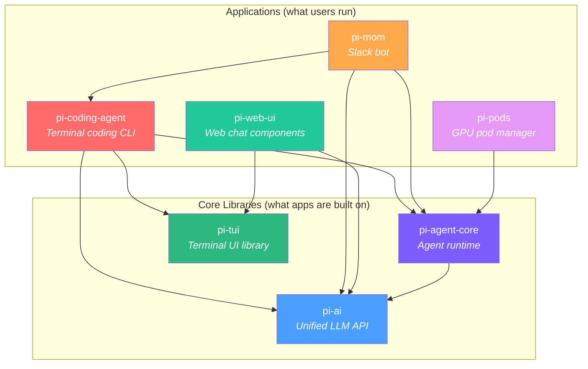

**Read the arrows as "depends on".** Everything flows down to `pi-ai`, the foundation that talks to LLMs.

---

## 3. What Each Package Does (Plain English)

### 3.1 `pi-ai` -- The Universal Translator

**One sentence:** Lets you call *any* LLM provider with a single, consistent API.

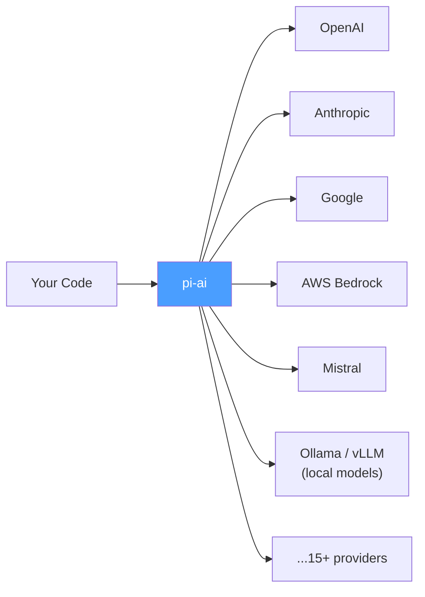

**Why it matters:** Without this, you'd write different code for every provider. With it, switching from GPT-4 to Claude to Gemini is a one-line change.

**Key concepts:**
| Concept | What it means |
|---------|--------------|
| **Provider** | A company/service that hosts LLMs (OpenAI, Anthropic, etc.) |
| **Model** | A specific AI brain (e.g. `gpt-4o`, `claude-sonnet-4-20250514`, `gemini-2.0-flash`) |
| **Streaming** | Getting the response word-by-word instead of waiting for the whole thing |
| **Tool calling** | The LLM says "I want to call function X with args Y" -- your code runs it, sends the result back |
| **Thinking** | Some models can "think out loud" before answering (reasoning tokens) |

**Where to look:**
- `packages/ai/src/providers/` -- one file per provider (anthropic.ts, openai-responses.ts, google.ts...)
- `packages/ai/src/stream.ts` -- the unified streaming entry point
- `packages/ai/src/types.ts` -- all the TypeScript types
- `packages/ai/src/models.generated.ts` -- auto-generated catalog of every known model

---

### 3.2 `pi-agent-core` -- The Brain Loop

**One sentence:** Takes an LLM and tools, then runs a loop: ask the LLM -> it picks a tool -> run the tool -> feed result back -> repeat until done.

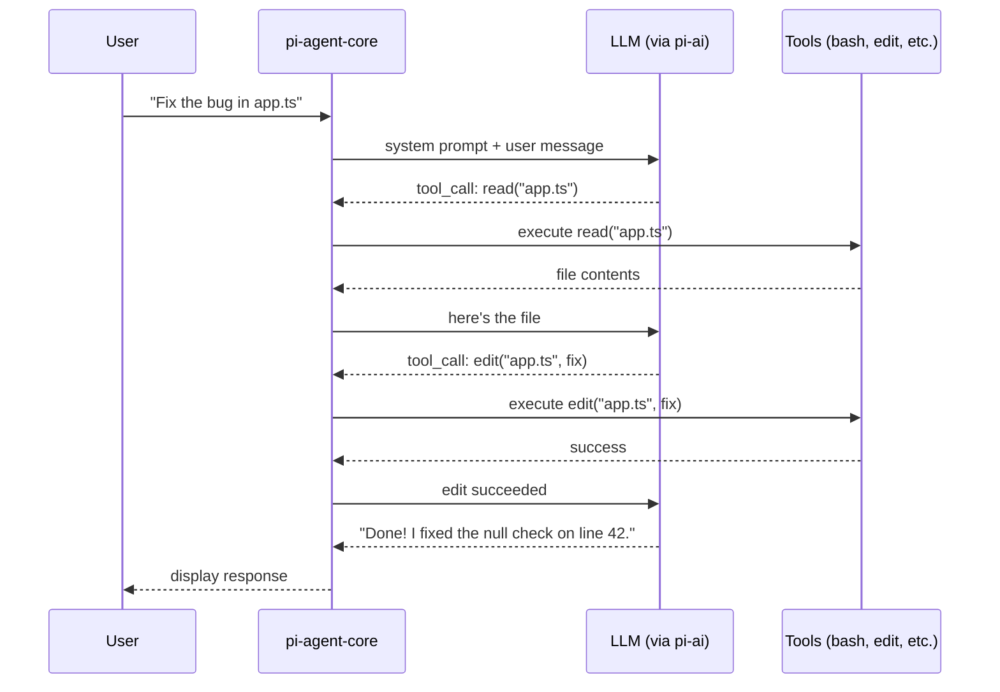

**Key concepts:**
| Concept | What it means |
|---------|--------------|
| **Agent loop** | The ask-tool-respond cycle that keeps going until the LLM says "I'm done" |
| **AgentTool** | A function the LLM can call -- has a name, description, parameter schema, and execute function |
| **Steering** | Interrupting the agent mid-run to redirect it ("Actually, focus on the tests instead") |
| **Follow-up** | Queueing a message to send after the current turn finishes |
| **Events** | The agent emits events (turn_start, message_update, tool_execution, etc.) so UIs can react in real-time |

**Where to look:**
- `packages/agent/src/agent.ts` -- the `Agent` class
- `packages/agent/src/agent-loop.ts` -- the core loop logic
- `packages/agent/src/types.ts` -- message and event types

---

### 3.3 `pi-coding-agent` -- The Star of the Show

**One sentence:** A terminal app (like Cursor or Claude Code) that uses the agent loop to read, write, edit, and execute code on your machine.

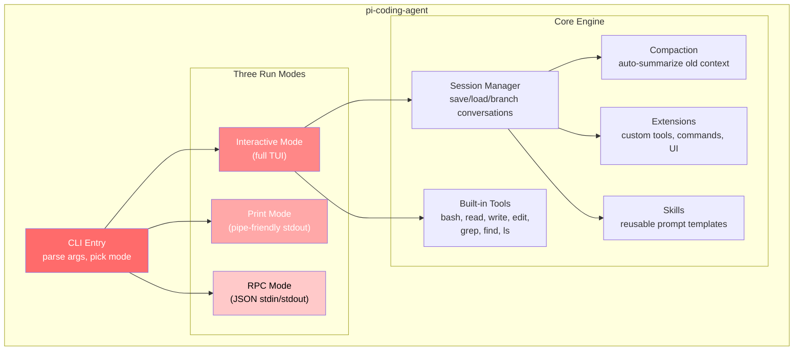

**The three modes explained:**

| Mode | When to use | How it works |
|------|------------|--------------|
| **Interactive** | Day-to-day coding | Full terminal UI with editor, markdown, syntax highlighting |
| **Print** | Piping output | Streams text to stdout -- great for `pi "explain this" \| less` |
| **RPC** | Embedding in other tools | JSON protocol over stdin/stdout -- other programs can control pi |

**Built-in tools the LLM can use:**

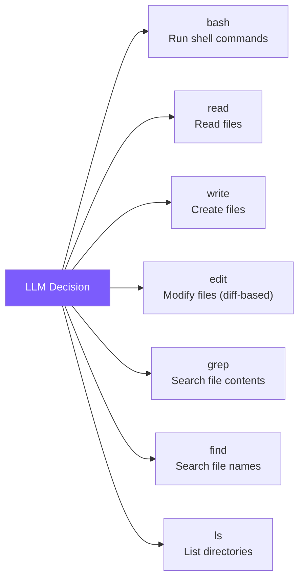

**Where to look:**
- `packages/coding-agent/src/cli.ts` -- CLI entry point
- `packages/coding-agent/src/core/tools/` -- each tool implementation
- `packages/coding-agent/src/core/agent-session.ts` -- session management
- `packages/coding-agent/src/core/extensions/` -- extension system
- `packages/coding-agent/src/modes/` -- the three run modes

---

### 3.4 `pi-tui` -- The Pretty Terminal

**One sentence:** A library for building rich terminal UIs with smart re-rendering (only redraws what changed).

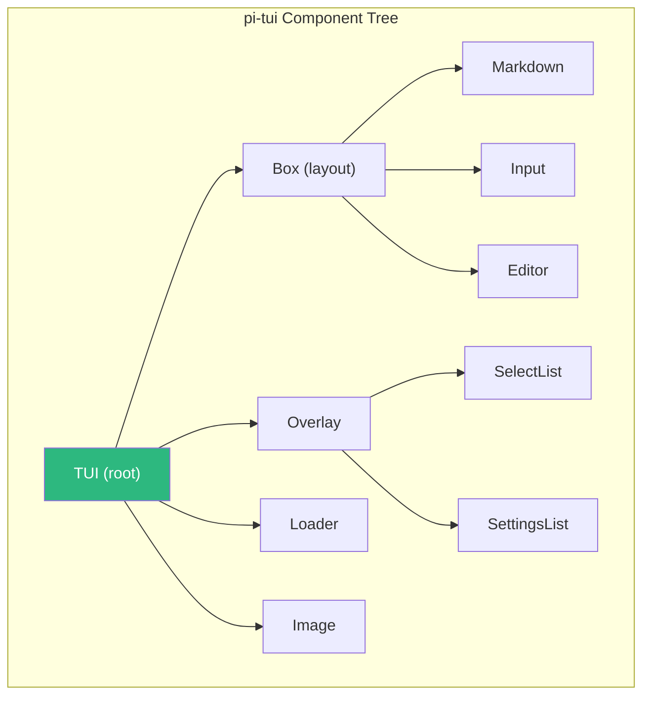

**Key idea:** Differential rendering. Instead of clearing and redrawing the whole screen 60 times per second (which causes flicker), it compares the old screen with the new one and only updates the lines that changed.

---

### 3.5 `pi-mom` -- The Slack Bot

**One sentence:** A Slack bot that receives messages and delegates them to pi-coding-agent running in a sandbox.

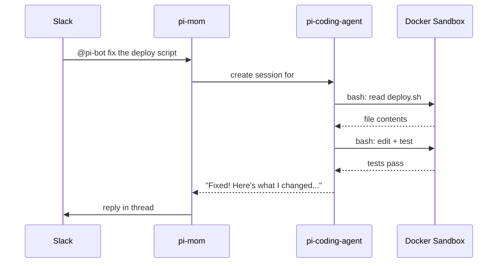

**Where to look:**
- `packages/mom/src/slack.ts` -- Slack Socket Mode connection
- `packages/mom/src/agent.ts` -- agent orchestration
- `packages/mom/src/sandbox.ts` -- Docker sandbox config

---

### 3.6 `pi-web-ui` -- Web Chat Components

**One sentence:** Drop-in web components (built with Lit) for AI chat interfaces, with artifact rendering (HTML, PDF, code, images).

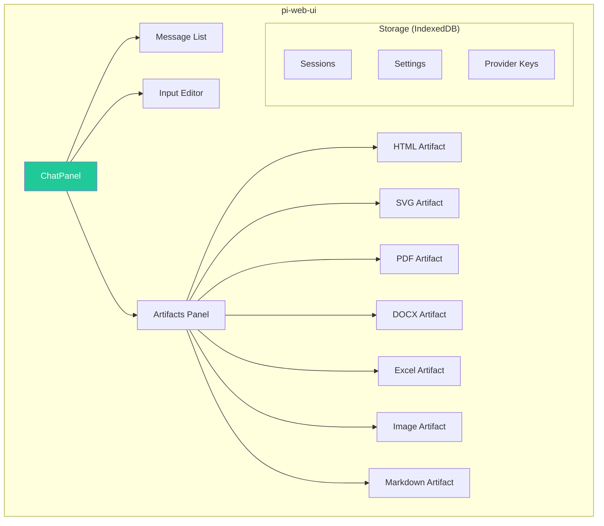

---

### 3.7 `pi-pods` -- GPU Pod Manager

**One sentence:** A CLI to deploy and manage vLLM (a fast open-source LLM server) on rented GPU machines.

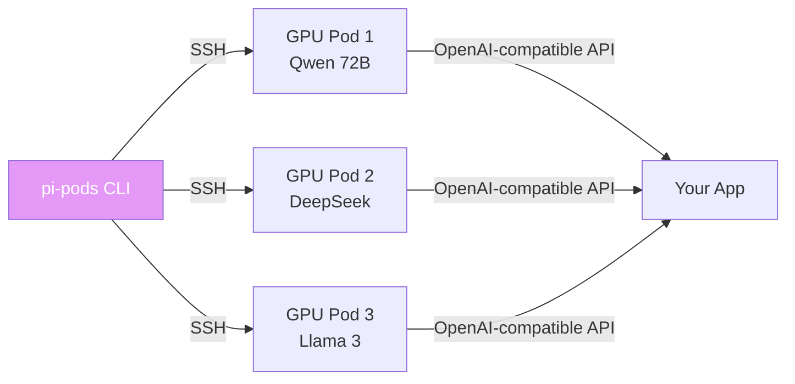

---

## 4. Full System Architecture

Here's how everything fits together when the coding agent is running:

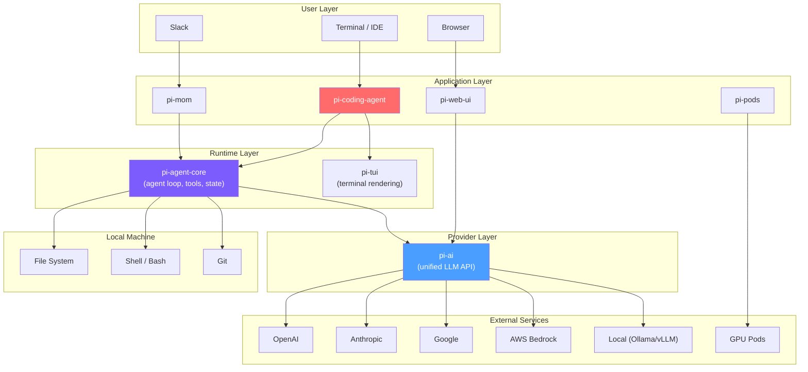

---

## 5. Data Flow -- A Single Coding Request

What happens when you type `"add error handling to server.ts"` in the terminal:

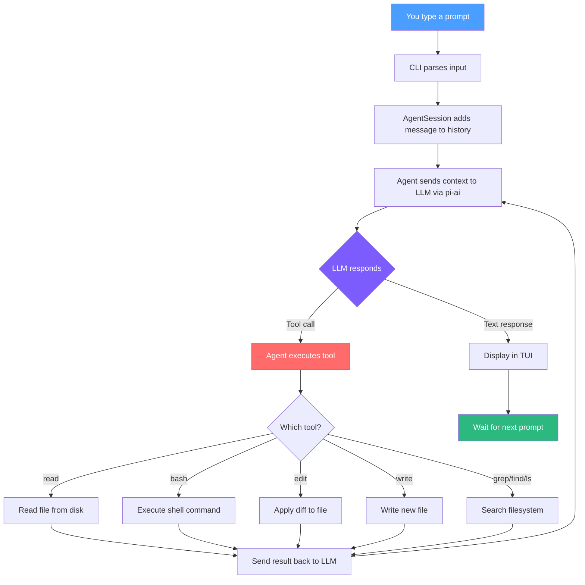

The loop (D -> E -> G -> N -> D) is the **agent loop**. It keeps going until the LLM decides it's done and responds with just text (no tool calls).

---

## 6. Security Architecture

### 6.1 Credential Management

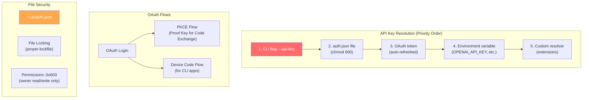

**What this means for you:**
- Credentials are stored in `~/.pi/auth.json` with strict file permissions (only your user can read it)
- File locking prevents race conditions when multiple agent instances run simultaneously
- OAuth uses PKCE -- the most secure flow for CLI apps (no secrets stored in the app itself)
- The system tries multiple sources in order, so you can set keys however you prefer

### 6.2 Command Execution Security

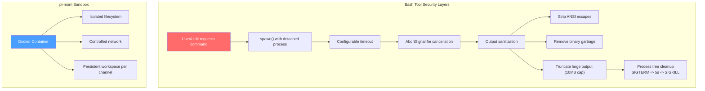

**Key security measures:**

| Layer | What it does | Why it matters |
|-------|-------------|----------------|
| **Detached processes** | Bash commands run in their own process group | Can kill the whole tree if something hangs |
| **Timeouts** | Commands auto-kill after N seconds | Prevents infinite loops from eating resources |
| **Output sanitization** | Strips ANSI codes, binary data | Prevents terminal injection attacks |
| **Output truncation** | Caps at ~10MB | Prevents memory exhaustion |
| **Process tree kill** | SIGTERM then SIGKILL | No orphaned processes left behind |
| **Docker sandbox (mom)** | Slack bot runs in isolated containers | Untrusted Slack users can't escape to host |
| **File permissions** | auth.json is 0o600 | Other users on the machine can't read your keys |
| **Tool schema validation** | TypeBox + AJV validate all tool params | LLM can't pass malformed data to tools |

### 6.3 Input Validation Pipeline

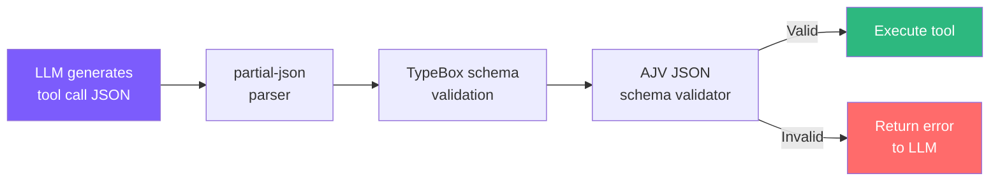

---

## 7. Extension Architecture

One of the most powerful features for building your own agentic systems:

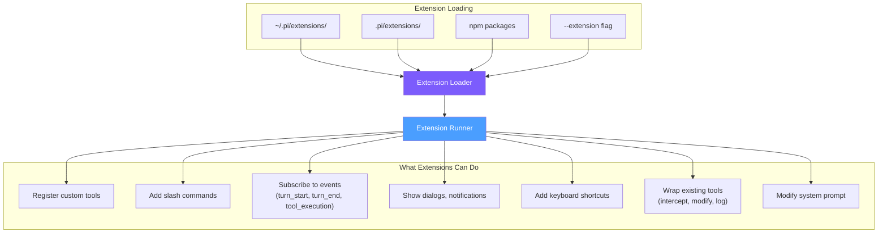

**This is your main entry point for building custom agentic systems.** You can:
1. Add new tools (web scraping, database queries, API calls, etc.)
2. Wrap existing tools (add logging, approval gates, rate limiting)
3. React to events (trigger actions when the agent reads a file, runs a command, etc.)
4. Build custom UIs (dialogs, settings panels)

---

## 8. Session & Memory Architecture

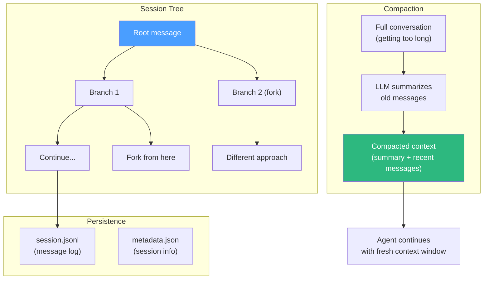

**Why this matters:**
- **Branching** -- Try different approaches without losing your history (like git branches for conversations)
- **Compaction** -- When the conversation gets too long for the LLM's context window, older messages are summarized automatically so you can keep working indefinitely
- **Persistence** -- Sessions are saved as JSONL files, so you can resume any time

---

## 9. The Technology Stack (Glossary for Beginners)

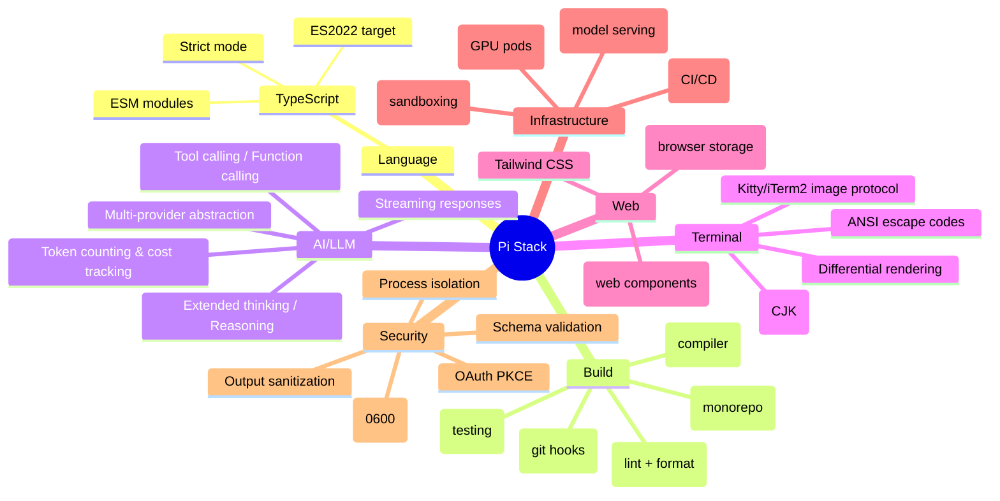

| Term | Plain English |
|------|--------------|
| **TypeScript** | JavaScript with types -- catches bugs before you run the code |
| **ESM** | Modern `import/export` syntax (vs old `require()`) |
| **Monorepo** | All packages in one repo -- shared tooling, atomic changes |
| **npm workspaces** | npm's built-in way to manage multiple packages in one repo |
| **Biome** | Fast linter and formatter (replaces ESLint + Prettier) |
| **Vitest** | Test runner (like Jest but faster, built for ESM) |
| **Lit** | Google's library for building web components |
| **IndexedDB** | Browser database for storing sessions/settings |
| **vLLM** | Open-source server for running LLMs on GPUs efficiently |
| **PKCE** | Secure OAuth flow that doesn't require storing a client secret |
| **JSONL** | One JSON object per line -- easy to append, stream, and parse |
| **Tool calling** | LLM says "run this function" -- the framework runs it and sends results back |
| **Compaction** | Summarizing old conversation to fit in the context window |
| **TypeBox** | Define schemas in TypeScript that work at runtime for validation |

---

## 10. How to Build Your Own Agentic System on Pi

### Path 1: Extension (Simplest)

Write a TypeScript file, drop it in `.pi/extensions/`, and it runs inside pi.

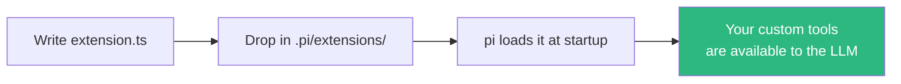

### Path 2: Custom Agent (Full Control)

Use `pi-agent-core` and `pi-ai` as libraries in your own app.

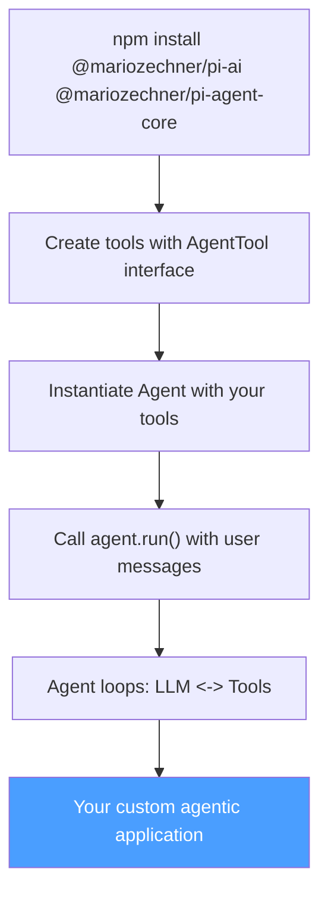

### Path 3: Full-Stack Agent App

Combine the web UI with a backend agent for a ChatGPT-like experience with custom tools.

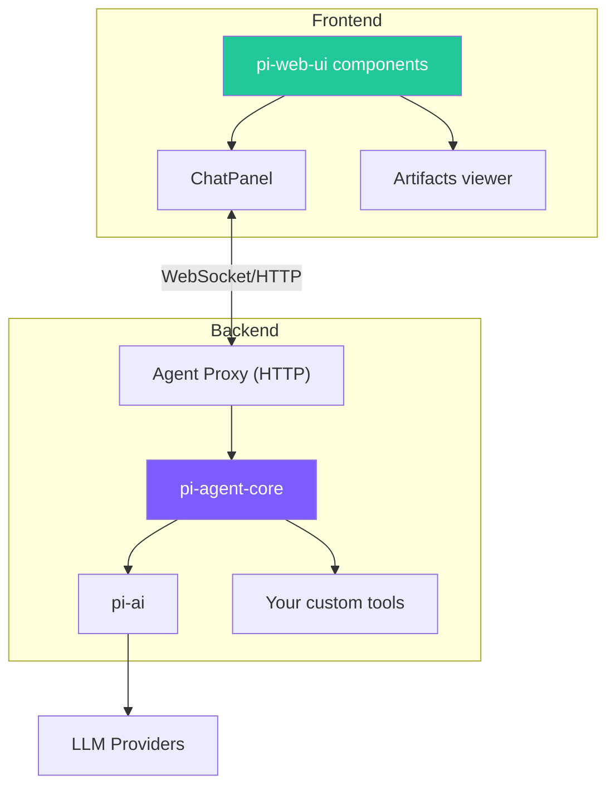

---

## 11. Directory Layout Quick Reference

```
pi-mono/
|-- packages/
|   |-- ai/                  # LLM provider abstraction
|   |   |-- src/providers/   # One file per LLM provider
|   |   |-- src/stream.ts    # Unified streaming entry point
|   |   +-- src/types.ts     # Core types
|   |
|   |-- agent/               # Agent runtime
|   |   |-- src/agent.ts     # Agent class
|   |   +-- src/agent-loop.ts# The ask-tool-respond loop
|   |
|   |-- coding-agent/        # Terminal coding assistant
|   |   |-- src/core/tools/  # bash, read, write, edit, grep, find, ls
|   |   |-- src/core/extensions/ # Extension system
|   |   |-- src/modes/       # interactive, print, rpc
|   |   +-- docs/            # Extensive documentation
|   |
|   |-- tui/                 # Terminal UI components
|   |   +-- src/components/  # box, input, editor, markdown, etc.
|   |
|   |-- mom/                 # Slack bot
|   |   +-- src/slack.ts     # Socket Mode integration
|   |
|   |-- web-ui/              # Web chat components (Lit)
|   |   |-- src/components/  # ChatPanel, messages, artifacts
|   |   +-- src/storage/     # IndexedDB backend
|   |
|   +-- pods/                # GPU pod management
|       +-- src/commands/    # pods, models, prompt
|
|-- .github/workflows/       # CI/CD pipelines
|-- biome.json               # Linter/formatter config
|-- tsconfig.json            # Root TypeScript config
+-- package.json             # Workspace root
```

---

## 12. Contributing Checklist

```mermaid
flowchart TD
    START["Pick something to work on"] --> INSTALL["npm install"]
    INSTALL --> BUILD["npm run build"]
    BUILD --> CODE["Make your changes"]
    CODE --> CHECK["npm run check<br/>(lint + types)"]
    CHECK -->|Errors| CODE
    CHECK -->|Clean| TEST["Run relevant tests"]
    TEST -->|Failing| CODE
    TEST -->|Passing| COMMIT["Commit with descriptive message"]

    style START fill:#4a9eff,color:#fff
    style COMMIT fill:#2db87f,color:#fff
```

**Rules of the road:**
- No `any` types unless absolutely necessary
- No inline/dynamic imports -- always top-level `import` statements
- Run `npm run check` before committing (it catches lint, format, and type errors)
- Never run `npm run dev`, `npm run build`, or `npm test` (use specific test commands instead)
- Use `git add <specific-files>` not `git add .` (multiple agents may work in parallel)

---

## 13. Key Design Decisions

| Decision | Why |
|----------|-----|
| **npm workspaces (no Turborepo/Nx)** | Simplicity -- fewer tools, less config, npm handles it |
| **TypeBox for schemas** | Schemas defined in TypeScript, validated at runtime, used for LLM tool params |
| **File-based storage (no database)** | Sessions are JSON files -- no DB to set up, easy to inspect and debug |
| **ESM only** | Modern standard, tree-shakeable, faster startup |
| **Biome (not ESLint)** | Orders of magnitude faster, single tool for lint + format |
| **Detached process spawning** | Full control over process lifecycle, clean kills |
| **Differential TUI rendering** | No flicker, low CPU, works over slow SSH connections |
| **Web Components (Lit)** | Framework-agnostic -- works in React, Vue, Svelte, or vanilla HTML |

---

*This document was generated to help new contributors understand the Pi monorepo architecture. For detailed API docs, see the README.md in each package directory.*
